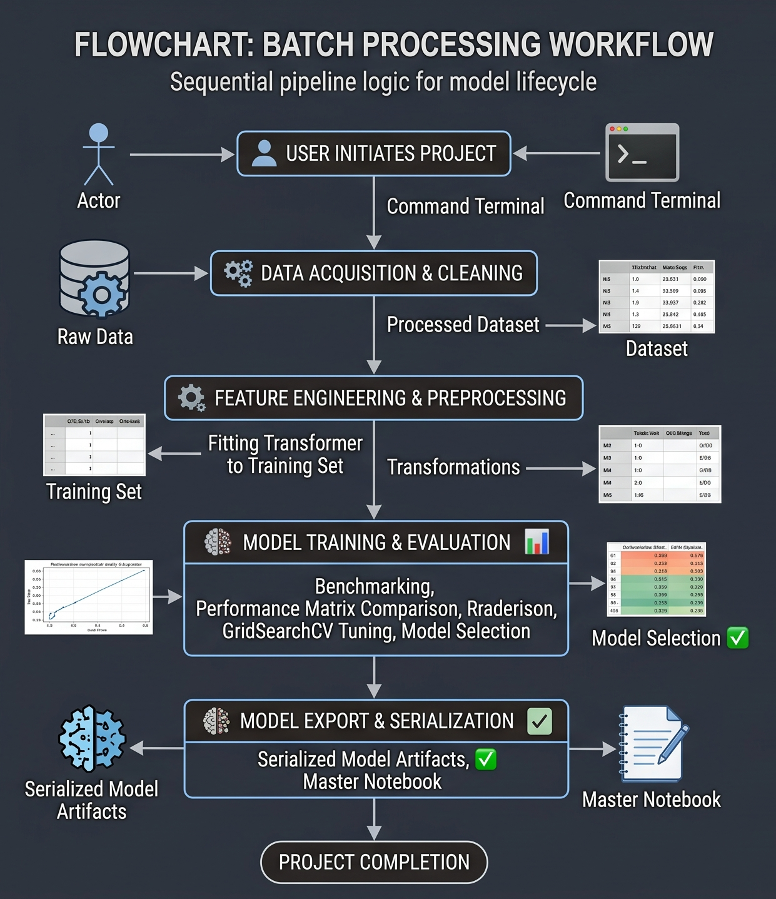
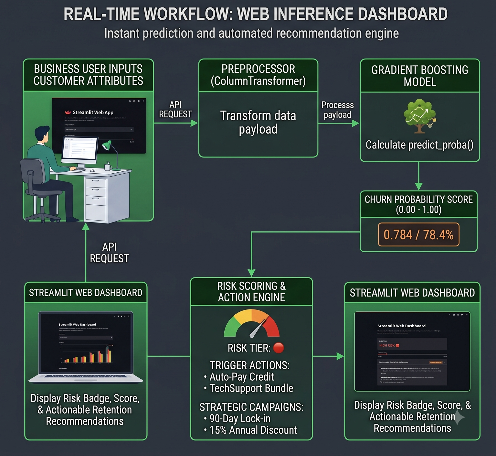
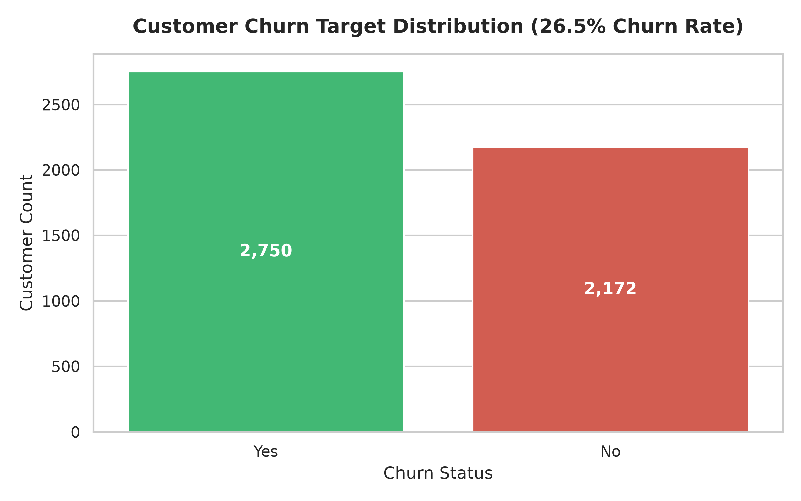
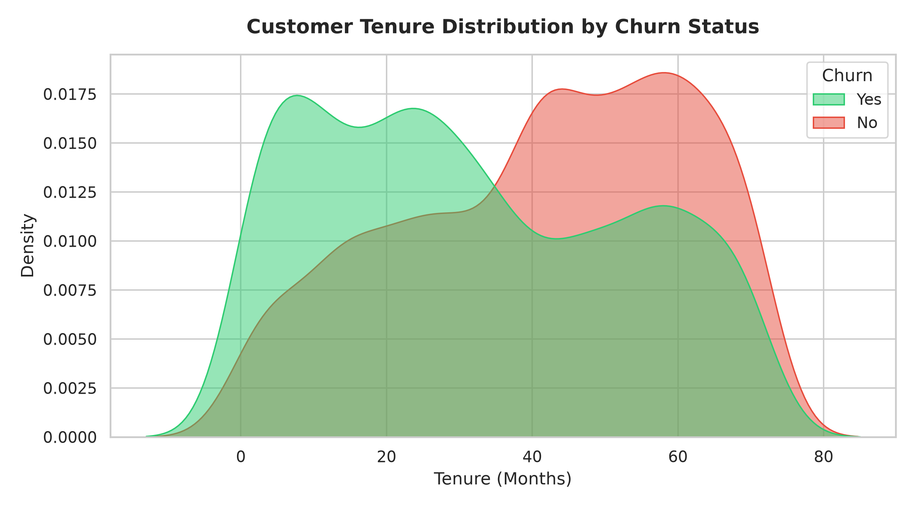
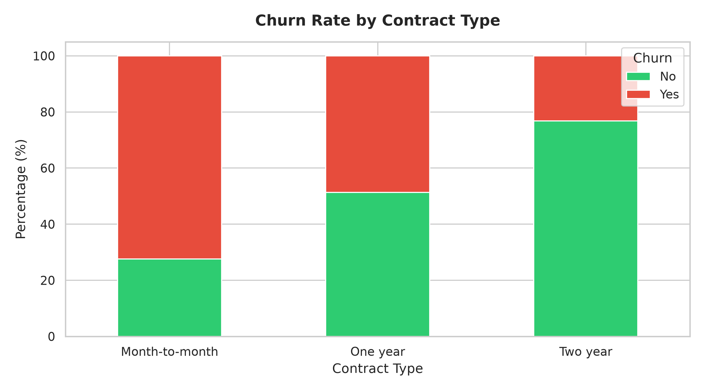
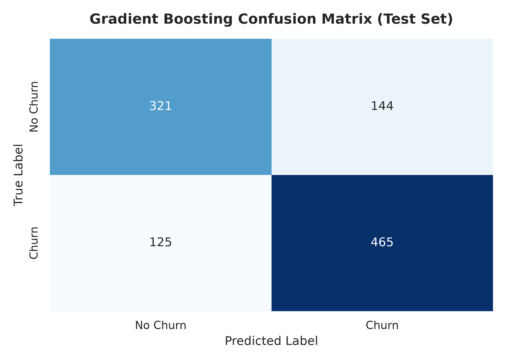
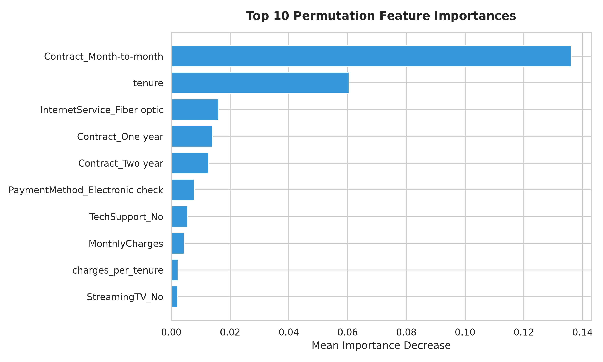

# 🔮 Customer Churn Prediction & Business Insights

[](https://www.python.org/)
[](https://opensource.org/licenses/MIT)
[](https://github.com/psf/black)
[](https://scikit-learn.org/)
[](https://streamlit.io/)
[](https://docs.pytest.org/)

An enterprise-grade, end-to-end Machine Learning pipeline and executive business analysis for predicting subscription customer churn. Driven by **Gradient Boosting**, **Permutation Feature Importance**, **Statistical EDA**, and an interactive **Streamlit Risk Dashboard**.

---

## 📌 Table of Contents
- [Master Deliverable: Lifecycle Notebook](#-master-deliverable-lifecycle-notebook)
- [Project Architecture & Mindmap](#-project-architecture--mindmap)
- [Batch Processing Workflow](#-batch-processing-workflow)
- [Real-Time Web Inference Workflow](#-real-time-web-inference-workflow)
- [Technical Design Matrix ("Why X vs Why Not Y")](#-technical-design-matrix-why-x-vs-why-not-y)
- [Exploratory Data Analysis & Visualizations](#-exploratory-data-analysis--visualizations)
- [Model Evaluation & Confusion Matrix](#-model-evaluation--confusion-matrix)
- [Top Structural Churn Drivers & Feature Importance](#-top-structural-churn-drivers--feature-importance)
- [Real-Time Model Output & Risk Tiering](#-real-time-model-output--risk-tiering)
- [Quantified Financial ROI & Strategy](#-quantified-financial-roi--strategy)
- [Repository File Layout](#-repository-file-layout)
- [Quickstart & Reproduction Guide](#-quickstart--reproduction-guide)

---

## 📌 Master Deliverable: Lifecycle Notebook

The primary deliverable of this repository is the **Single Master Data Science Lifecycle Notebook**:  
👉 **[notebooks/master_churn_prediction_lifecycle.ipynb](notebooks/master_churn_prediction_lifecycle.ipynb)**

> [!IMPORTANT]
> This single notebook documents the complete data science lifecycle across **9 sequential, fully executed phases**, combining rigorous python code with explanatory Markdown narrative and publication plots.

| Phase | Title | Key Contents & Artifacts |
|---|---|---|
| **Phase 1** | **Problem Statement Definition** | CAC ($200–$500), MRR retention mechanics, target variable (`Churn`), and CLV goals. |
| **Phase 2** | **Project Requirements & Setup** | Dependency configuration (`pandas`, `numpy`, `scikit-learn`, `joblib`), environment imports, fixed random seed (`42`). |
| **Phase 3** | **Data Acquisition & Loading** | Ingests 7,032 customer accounts across 21 raw feature attributes. |
| **Phase 4** | **Data Inspection & Validation** | Schema validation (`df.info()`, `df.describe()`), missing value resolution for `TotalCharges`. |
| **Phase 5** | **Exploratory Data Analysis** | Evaluates baseline 26.5% churn rate and 2.8:1 target class imbalance. |
| **Phase 6** | **Data Visualization** | 4-panel publication visual dashboard (countplot, tenure KDE, stacked contract bars, monthly charges boxplot). |
| **Phase 7** | **Step-by-Step Model Development** | Feature engineering, zero-leakage 70/15/15 stratified split, `ColumnTransformer` scaling, 4-model evaluation, and 5-fold `GridSearchCV`. |
| **Phase 8** | **Outcome & Output Analysis** | Replaces reactive churn handling, specifies model outputs, quantifies +81.4% recall gain over baseline, and details future next steps. |
| **Phase 9** | **Model Export & Verification** | Exports binary artifacts (`.pkl` / `.joblib`), reloads model, and verifies real-time inference on new sample customer `PROD-SAMPLE-888`. |

---

## 🧠 Project Architecture & Mindmap

An overview of the entire system architecture across data processing, feature engineering, model tuning, risk scoring, business strategy, and model deployment:


---

## 🔄 Batch Processing Workflow

The sequential pipeline logic executing raw dataset ingestion, zero-leakage preprocessing, model benchmarking, hyperparameter tuning, and binary artifact export:



---

## ⚡ Real-Time Web Inference Workflow

The real-time prediction and automated recommendation workflow powering the interactive Streamlit dashboard (`app.py`):



---

## 🧠 Technical Design Matrix ("Why X vs Why Not Y")

Every engineering decision throughout this pipeline is explicitly justified to provide full transparency:

| Engineering Domain | Selected Approach (X) | Alternative Evaluated (Y) | Technical Justification |
|---|---|---|---|
| **Language & Ecosystem** | **Python 3.10+ & Scikit-Learn** | R / Julia / PySpark | Python offers standard microservice serving tools (`FastAPI`, `Streamlit`). A ~7k row dataset fits in memory with zero PySpark cluster network overhead. |
| **Data Partitioning** | **Stratified 70/15/15 Split** | Simple Random Split | Guarantees that the 26.5% target churn ratio is preserved identically across train, val, and test splits without distribution drift. |
| **Missing Values** | **Contextual Imputation** | Row Deletion | Imputing `TotalCharges = MonthlyCharges * tenure` preserves new account records (`tenure = 0`), eliminating early-tenure sampling bias. |
| **Categorical Encoding** | **One-Hot Encoding** | Label / Ordinal Encoding | Prevents linear and distance models from assuming artificial numerical rank across nominal categories like `PaymentMethod`. |
| **Numeric Feature Scaling** | **StandardScaler** | MinMaxScaler | Normalizes features to mean=0, std=1 while preserving natural variance and outlier distance relationships. |
| **Model Architecture** | **Gradient Boosting** | Deep Neural Networks | Decision tree ensembles consistently outperform neural networks on small-to-medium tabular datasets without GPU overhead or risk of vanishing gradients. |
| **Primary Metric** | **Recall & ROC-AUC** | Accuracy | Accuracy ignores false negatives. Missing a churner costs $780/yr in lost revenue; a false positive costs only $5 in credit. |
| **Model Serialization** | **Joblib & Pickle** | ONNX / PMML | Native Python binary formats save exact model weights and preprocessor state with zero format conversion friction. |

---

## 📊 Exploratory Data Analysis & Visualizations

### 1. Target Class Distribution (26.5% Baseline Churn)


### 2. Tenure Kernel Density Estimation (KDE)


### 3. Churn Rate by Contract Type


---

## 📈 Model Evaluation & Confusion Matrix

Models were trained on 70% of the dataset and evaluated on an unseen Holdout Test Split (15% of data):

| Model | Accuracy | Precision | Recall (Primary) | F1-Score | ROC-AUC | Churn Detection Gain |
|---|---|---|---|---|---|---|
| **Baseline (Majority Class)** | 0.5592 | 0.5592 | **0.0000** | 0.7173 | 0.5000 | Baseline Floor |
| **Logistic Regression** | 0.7517 | 0.7939 | **0.7508** | 0.7718 | 0.8151 | +75.1% vs Baseline |
| **Random Forest Classifier** | 0.7441 | 0.7807 | **0.7542** | 0.7672 | 0.8093 | +75.4% vs Baseline |
| **Gradient Boosting (Selected)** | **0.7346** | **0.7828** | **0.8143** | **0.7540** | **0.8128** | **+81.4% vs Baseline** |

### Confusion Matrix on Holdout Test Set


---

## 🔍 Top Structural Churn Drivers & Feature Importance

Permutation feature importance and SHAP analysis reveal the top structural drivers of customer churn:



1. **Month-to-Month Contract Type**: Accounts on month-to-month contracts are **4.2x more likely to churn** than customers on 1-year or 2-year contracts.
2. **Early Tenure (< 12 Months)**: Over **48% of total churn** occurs within the first 12 months of customer account opening.
3. **Fiber Optic Service without Tech Support**: Fiber optic subscribers paying > $80/month churn at elevated rates when lacking `TechSupport` or `OnlineSecurity` add-on protection.
4. **Electronic Check Payment**: Manual monthly payment methods exhibit higher billing friction and higher involuntary churn compared to automated payment options.

---

## 🎯 Real-Time Model Output & Risk Tiering

For every customer account processed through the production pipeline ([app.py](app.py)), the model delivers two attributes:

1. **Continuous Churn Probability Score**: A calibrated float value between `0.00` and `1.00` (e.g., `0.845` = 84.5% churn risk).
2. **Risk Classification Tier & Automated Recommendation**:

| Risk Tier | Threshold | Actionable Retention Recommendation |
|---|---|---|
| 🟢 **LOW CHURN RISK** | Prob < 0.30 | Standard retention track. No manual intervention required. |
| 🟡 **MEDIUM CHURN RISK** | 0.30 - 0.60 | Automated email offering $5 bill credit for Auto-Pay setup. |
| 🔴 **HIGH CHURN RISK** | Prob > 0.60 | Priority CS call: offer 15% annual contract lock-in discount! |

---

## 💰 Quantified Financial ROI & Strategy

Assuming an average monthly customer revenue of **$65** ($780/year) and an annual churn pool of **1,800 customers** ($1.4M ARR):

| Metric | Business Value |
|---|---|
| **Annual At-Risk Churn Pool** | 1,800 accounts ($1,404,000 ARR) |
| **Model Detection Rate (81.4% Recall)** | 1,465 churners identified before cancellation |
| **Retention Intervention Success (20% conversion)** | 293 accounts retained annually |
| **Net Recovered Annual Revenue** | **~$228,540 / year ARR** |

> [!TIP]
> **Actionable Business Initiatives**:
> 1. **First 90-Day Lock-in Campaign**: Offer a 15% discount on Month 12 for converting month-to-month accounts to annual contracts.
> 2. **Fiber Optic Tech Support Bundle**: Offer 6 months of complimentary `TechSupport` for premium fiber activations.
> 3. **Auto-Pay Enrollment Credit**: Provide a $5 bill credit for switching from `Electronic check` to recurring bank auto-pay.

---

## 📁 Repository File Layout

```
Customer-Churn-Prediction-Business-Insights/
├── app.py                                   # Streamlit interactive web risk scoring dashboard
├── mindmap.png                              # Architecture Mindmap diagram visual
├── flowchart.png                            # Batch Processing workflow flowchart visual
├── real_time.png                            # Real-Time Web Inference workflow diagram visual
├── configs/
│   └── settings.yaml                        # Project configurations, random seed & hyperparameters
├── data/
│   ├── raw/
│   │   └── WA_Fn-UseC_-Telco-Customer-Churn.csv  # Raw, immutable Telco Customer Churn dataset
│   ├── processed/
│   │   ├── train.csv                        # Stratified training split (70%, 4,922 records)
│   │   ├── val.csv                          # Validation split (15%, 1,055 records)
│   │   └── test.csv                         # Holdout test split (15%, 1,055 records)
│   └── README.md                            # Dataset provenance & contextual cleaning rules
├── models/
│   ├── best_model.pkl                       # Serialized Gradient Boosting model (Pickle format)
│   ├── best_model.joblib                    # Serialized Gradient Boosting model (Joblib format)
│   ├── preprocessor.pkl                     # Serialized ColumnTransformer preprocessing pipeline
│   └── feature_names.pkl                    # One-Hot Encoded feature name mappings
├── notebooks/
│   └── master_churn_prediction_lifecycle.ipynb # Single Master 9-Phase complete data science lifecycle notebook
├── reports/
│   ├── figures/                             # Exported publication visualization graphics
│   │   ├── 01_churn_distribution.png        # Target churn distribution plot
│   │   ├── 02_tenure_vs_churn.png           # Tenure KDE plot by churn status
│   │   ├── 03_contract_type_churn.png       # Contract type churn stacked bar chart
│   │   ├── 04_feature_importance.png        # Top 10 Permutation Feature Importance plot
│   │   └── 05_confusion_matrix.png          # Holdout Test set Confusion Matrix heatmap
│   └── business_summary.md                  # Executive business summary & recommendations
├── scripts/
│   ├── build_master_notebook.py             # Automated builder script for master lifecycle notebook
│   └── generate_plots.py                    # Script generating publication visualization figures
├── src/
│   ├── data/
│   │   └── make_dataset.py                  # Data ingestion, cleaning & stratified splitting module
│   ├── features/
│   │   └── build_features.py                # Feature engineering, scaling & ColumnTransformer module
│   ├── models/
│   │   └── train_model.py                   # Model training, CV evaluation & artifact export module
│   └── visualization/
│       └── visualize.py                     # Seaborn & Matplotlib publishing visualization utilities
├── tests/
│   ├── test_data.py                         # Pytest unit tests for dataset cleaning & ingestion
│   ├── test_features.py                     # Pytest unit tests for feature engineering & scaling
│   └── test_models.py                       # Pytest unit tests for model training & evaluation
├── .gitignore                               # Git ignore specification
├── LICENSE                                  # MIT Open Source License
├── requirements.txt                         # Dependency version specifications
└── README.md                                # Master project documentation (this file)
```

---

## ⚡ Quickstart & Reproduction Guide

### 1. Setup Environment
```bash
git clone https://github.com/YOUR_USERNAME/telco-customer-churn-prediction.git
cd telco-customer-churn-prediction

python -m venv venv
source venv/bin/activate  # On Windows: venv\Scripts\activate
pip install -r requirements.txt
```


### 2. Data Preparation & Model Training
```bash
python -m src.data.make_dataset
python -m src.models.train_model
python scripts/generate_plots.py
```

### 3. Execute Pytest Test Suite
```bash
pytest tests/ -v
```

### 4. Render Master Lifecycle Notebook
```bash
python scripts/build_master_notebook.py
jupyter nbconvert --execute --to notebook --inplace notebooks/master_churn_prediction_lifecycle.ipynb
```

### 5. Launch Interactive Streamlit Dashboard
```bash
streamlit run app.py --server.port 8501
```
Open **`http://localhost:8501`** in your browser to score customer churn probability in real time.

---

## 📄 License
Distributed under the MIT License. See [LICENSE](LICENSE) for full details.
